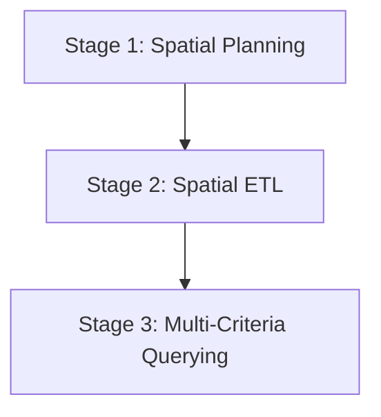

# Wherobots & Antigravity Playbook

## Summary

Use this playbook to configure, execute, and troubleshoot geospatial ETL pipelines and Spatial SQL queries on the Wherobots Cloud environment using the Antigravity AI coding assistant and Python SDKs.

---

## The Sequential Geospatial Lifecycle

To build reliable and performant spatial models at scale, follow this structured, sequential three-stage lifecycle:



### Stage 1: Spatial Planning & Data Alignment
Before writing ingestion scripts or queries, align on spatial datums and safety thresholds:
1. **Coordinate System (CRS) Definition**: Choose a standard projected CRS for calculations (e.g., `EPSG:7856` UTM Zone 56 for eastern Australia) and keep geographic layers in `EPSG:4326` (WGS84) for mapping.
2. **Buffer and Setback Specification**: Define the study area boundary, sub-precinct boundaries, and safety buffers (e.g., high-voltage grid setbacks, pipeline corridors, rail buffers).
3. **Graceful Degradation Design**: Identify which layers are optional or fallbacks (e.g., if a third-party WFS layer goes offline, have a local GeoJSON or fallback table ready).

### Stage 2: Spatial ETL (Ingestion)
Build a clean, incremental database schema in the catalog:
1. **Load Primary Boundaries First**: Ingest the main precinct and study area boundary tables first. This forms the clipping mask.
2. **Spatial Projection & Clean-Up**: Reproject all incoming vector datasets (Water, Biodiversity, Energy, Rail, Demographics) to the project’s target CRS. Clip or filter them dynamically using the study area mask to keep dataset sizes lightweight.
3. **Save to Table Catalog**: Write the cleaned geometries to the database catalog (`org_catalog.fgsdb.table_name`) using Havasu/Iceberg tables.

### Stage 3: Multi-Criteria Querying & Analysis
Analyze and score candidates across multiple criteria:
1. **Centroid-Based Offsets**: When measuring proximity to lines or zones (e.g., substations or waterways), measure from the **centroid** of candidate polygons (`ST_Centroid(geom)`) to avoid `0.0m` distances caused by direct boundary intersections.
2. **Refined Score Decay**: Avoid step-function scoring. Implement piecewise linear decay functions using SQL `CASE WHEN` statements to model realistic setbacks (e.g., optimal within 100m-500m, decaying to 0.0 at 5km).
3. **Extrapolated Projections**: For demographics, join multi-year tables (e.g., 2020 and 2025 census data) and extrapolate future growth rates (e.g., 2030 predictions) using growth rate equations.

---

## What this gives you

- **Serverless Spark Execution**: Offload heavy geospatial computations (such as polygon buffering and unioning) to a remote, distributed Spark cluster.
- **Agentic DB-API Queries**: Direct connection to WherobotsDB, returning results natively as Pandas DataFrames.
- **Robust Pipeline submission**: Run long-running Python scripts as headless Wherobots Spark jobs with automatic file dependency management.
- **Workspace Integration**: Use local editor commands or programmatic scripts to start runtimes, submit jobs, and inspect database catalogs.

---

## Setup & Connection Process

### Step 1: SDK & Driver Installation
Ensure you install both the DB-API driver (for running SQL queries and listing tables) and the job SDK (for submitting scripts):
```bash
python -m pip install wherobots-python-sdk wherobots-python-dbapi
```

### Step 2: Programmatic Job Submission
Use the `WherobotsJob` class from the SDK to package your local ingestion script and its configuration files:
```python
from wherobots import WherobotsJob

# Declare local file dependencies (e.g. JSON configuration files)
config_dep = WherobotsJob.add_file_dependency("config/settings.json")

# Initialize and submit the job
job = WherobotsJob(
    script="src/etl_pipeline.py",
    name="my-spatial-etl",
    runtime="tiny",
    api_key="<YOUR_WHEROBOTS_API_KEY>",
    dependencies=[config_dep],
)

job.submit()
print(f"Submitted Job ID: {job.run_id}")

# Wait and stream logs
status = job.wait_for_completion(stream_logs=True)
```

### Step 3: Programmatic Spatial SQL Connections
Establish a DB-API connection to run interactive queries and inspect tables. The driver returns Pandas DataFrames natively for all results:
```python
from wherobots.db import connect

conn = connect(api_key="<YOUR_WHEROBOTS_API_KEY>")
cursor = conn.cursor()

# Retrieve catalog tables
cursor.execute("SHOW TABLES IN org_catalog.my_database")
df_tables = cursor.fetchall()  # Returns a Pandas DataFrame!
print(df_tables)

# Execute spatial queries
cursor.execute("""
    SELECT study_area_id, ST_Area(net_developable_geom) / 1e4 AS area_ha 
    FROM org_catalog.my_database.net_developable_zones
""")
df_results = cursor.fetchall()
print(df_results)
```

---

## What not to do (Anti-patterns)

### Anti-pattern 1: Dynamic Coordinate Transformation in Join Predicates
*   **Why this fails**: Putting `ST_Transform(geometry, 'EPSG:XXXX', 'EPSG:YYYY')` inside the `ON ST_Intersects(...)` join predicate transforms the geometry for every single record comparison. This completely disables Spark/Sedona's spatial index, leading to slow nested loop joins that hang.
*   **Better approach**: Keep both tables in their native CRS (e.g. `EPSG:4326` or `EPSG:7856`), or transform the smaller table's geometry *once* inside a CTE before the join.

### Anti-pattern 2: Measuring Intersecting Distance boundary-to-boundary
*   **Why this fails**: If an industrial zone intersects a high-voltage grid line, boundary-to-boundary distance returns `0.0`. When analyzing sites, this creates a massive clump of `0.0` values, preventing the model from ranking relative closeness.
*   **Better approach**: Calculate distance from the **centroid** of the candidate polygon to the line string:
    ```sql
    ST_Distance(ST_Centroid(zone.geom), powerline.geom)
    ```

### Anti-pattern 3: Using Playwright or Puppeteer for HTML runner automation
*   **Why this fails**: The local browser environment can fail due to driver download mismatches or sandboxed network rules (e.g. Playwright downloading driver dependencies failing with 404).
*   **Better approach**: Communicate directly with the Jupyter Kernel API via WebSockets to execute code blocks and capture structured stdout streams.

### Anti-pattern 4: Double-transforming geometries in queries
*   **Why this fails**: If your ingestion loaders already reproject files (e.g. `gdf.to_crs("EPSG:7856")`) before saving them to Wherobots Havasu/Iceberg, applying `ST_Transform` again on the database query (treating them as if they are in EPSG:4326) will distort the coordinates and crash the executors.
*   **Better approach**: Track the projection of your database tables and query them directly in their native CRS.

### Anti-pattern 5: Buffering and unioning unfiltered global/state-wide networks
*   **Why this fails**: Trying to run buffers or spatial unions (`ST_Union_Aggr`) on a full statewide layer (e.g., a country-wide railway network) on a `tiny` or `small` Wherobots runtime will cause immediate JVM Out-of-Memory (`OOM`) errors.
*   **Better approach**: Join the spatial network with your study area boundary using `ST_Intersects` *before* applying buffers or union operations:
  ```sql
  SELECT ST_Buffer(g.geometry, 10.0) AS geom 
  FROM org_catalog.my_database.rail_network g
  JOIN study_area_transform p ON ST_Intersects(g.geometry, p.geom)
  ```

---

## Lessons Learned & Best Practices

- **Aggregate Function Names**: In Apache Sedona SQL, the aggregate union function is **`ST_Union_Aggr`**, not `ST_Union_Aggregate`.
- **Dynamic Dependency Paths**: When you add a file dependency (like `config/settings.json`) to a Wherobots job, Wherobots downloads it to `/opt/wherobots/settings.json` in the executor. Make sure your Python scripts check this directory in their candidate config paths.
- **Tolerating Missing Open Data**: Open-data APIs frequently go offline or change endpoints (e.g., returning HTTP 404). Wrap open data ingestion calls in `try-except` blocks and check table existence using `sedona.catalog.tableExists` to ensure the ETL pipeline degrades gracefully instead of failing entirely.
- **WebSocket Session Heartbeats**: When executing code programmatically on the Jupyter WebSocket kernel, send a heartbeat ping every 30 seconds to prevent the proxy gateway from closing the WebSocket socket during long-running Spark jobs.
