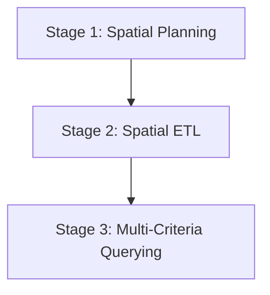

# Wherobots & Antigravity Playbook

## Summary

Use this playbook to configure, execute, and troubleshoot geospatial ETL pipelines and Spatial SQL queries on the Wherobots Cloud environment using the Antigravity AI coding assistant and Python SDKs.

---

## The Sequential Geospatial Lifecycle

To build reliable and performant spatial models at scale, follow this structured, sequential three-stage lifecycle:



### Stage 1: Spatial Planning & Data Alignment
Before writing ingestion scripts or queries, align on spatial datums and safety thresholds:
1. **Coordinate System (CRS) Definition**: Choose a standard projected CRS for calculations (e.g., `EPSG:7856` UTM Zone 56 for eastern Australia) and keep geographic layers in `EPSG:4326` (WGS84) for mapping.
2. **Buffer and Setback Specification**: Define the study area boundary, sub-precinct boundaries, and safety buffers (e.g., high-voltage grid setbacks, pipeline corridors, rail buffers).
3. **Graceful Degradation Design**: Identify which layers are optional or fallbacks (e.g., if a third-party WFS layer goes offline, have a local GeoJSON or fallback table ready).

### Stage 2: Spatial ETL (Ingestion)
Build a clean, incremental database schema in the catalog:
1. **Load Primary Boundaries First**: Ingest the main precinct and study area boundary tables first. This forms the clipping mask.
2. **Spatial Projection & Clean-Up**: Reproject all incoming vector datasets (Water, Biodiversity, Energy, Rail, Demographics) to the project’s target CRS. Clip or filter them dynamically using the study area mask to keep dataset sizes lightweight.
3. **Save to Table Catalog**: Write the cleaned geometries to the database catalog (`org_catalog.fgsdb.table_name`) using Havasu/Iceberg tables.

### Stage 3: Multi-Criteria Querying & Analysis
Analyze and score candidates across multiple criteria:
1. **Centroid-Based Offsets**: When measuring proximity to lines or zones (e.g., substations or waterways), measure from the **centroid** of candidate polygons (`ST_Centroid(geom)`) to avoid `0.0m` distances caused by direct boundary intersections.
2. **Refined Score Decay**: Avoid step-function scoring. Implement piecewise linear decay functions using SQL `CASE WHEN` statements to model realistic setbacks (e.g., optimal within 100m-500m, decaying to 0.0 at 5km).
3. **Extrapolated Projections**: For demographics, join multi-year tables (e.g., 2020 and 2025 census data) and extrapolate future growth rates (e.g., 2030 predictions) using growth rate equations.

---

## What this gives you

- **Serverless Spark Execution**: Offload heavy geospatial computations (such as polygon buffering and unioning) to a remote, distributed Spark cluster.
- **Agentic DB-API Queries**: Direct connection to WherobotsDB, returning results natively as Pandas DataFrames.
- **Robust Pipeline submission**: Run long-running Python scripts as headless Wherobots Spark jobs with automatic file dependency management.
- **Workspace Integration**: Use local editor commands or programmatic scripts to start runtimes, submit jobs, and inspect database catalogs.

---

## Setup & Connection Process

### Step 1: SDK & Driver Installation
Ensure you install both the DB-API driver (for running SQL queries and listing tables) and the job SDK (for submitting scripts):
```bash
python -m pip install wherobots-python-sdk wherobots-python-dbapi
```

### Step 2: Programmatic Job Submission
Use the `WherobotsJob` class from the SDK to package your local ingestion script and its configuration files:
```python
from wherobots import WherobotsJob

# Declare local file dependencies (e.g. JSON configuration files)
config_dep = WherobotsJob.add_file_dependency("config/settings.json")

# Initialize and submit the job
job = WherobotsJob(
    script="src/etl_pipeline.py",
    name="my-spatial-etl",
    runtime="tiny",
    api_key="<YOUR_WHEROBOTS_API_KEY>",
    dependencies=[config_dep],
)

job.submit()
print(f"Submitted Job ID: {job.run_id}")

# Wait and stream logs
status = job.wait_for_completion(stream_logs=True)
```

### Step 3: Programmatic Spatial SQL Connections
Establish a DB-API connection to run interactive queries and inspect tables. The driver returns Pandas DataFrames natively for all results:
```python
from wherobots.db import connect

conn = connect(api_key="<YOUR_WHEROBOTS_API_KEY>")
cursor = conn.cursor()

# Retrieve catalog tables
cursor.execute("SHOW TABLES IN org_catalog.my_database")
df_tables = cursor.fetchall()  # Returns a Pandas DataFrame!
print(df_tables)

# Execute spatial queries
cursor.execute("""
    SELECT study_area_id, ST_Area(net_developable_geom) / 1e4 AS area_ha 
    FROM org_catalog.my_database.net_developable_zones
""")
df_results = cursor.fetchall()
print(df_results)
```

### Step 4: Interactive Jupyter Notebooks (Visual Mapping)
You can open an interactive Jupyter notebook (`.ipynb`) in your editor to query and plot your spatial layers visually. For example, add the following to your file:
* Set up a code cell to initialize the Sedona Context:
  ```python
  from sedona.spark import *
  spark = SedonaContext.create(SedonaContext.builder().getOrCreate())
  ```
* Run query commands to visualize dataframes:
  ```python
  df = spark.read.table("org_catalog.my_database.net_developable_zones")
  df.show()
  ```

### Step 5: Wherobots Cloud UI Explorer
If you prefer an out-of-the-box UI interface, you can explore your data directly in the cloud:
1. Log in to [Wherobots Cloud](https://wherobots.cloud/).
2. Navigate to the **Query Editor** or start a Jupyter Notebook.
3. Query the Iceberg tables directly using Spatial SQL:
   ```sql
   SELECT * FROM org_catalog.my_database.net_developable_zones LIMIT 10;
   ```

---

## Data Verification & Testing

Verify that your remote ETL outputs are populated and valid by executing assertion checks against the Havasu/Iceberg tables:

```python
import sys
from wherobots.db import connect

def verify_etl_run(api_key: str):
    conn = connect(api_key=api_key)
    cursor = conn.cursor()
    
    # 1. Verify table counts are non-zero
    print("Testing table row counts...")
    cursor.execute("SELECT COUNT(*) AS row_count FROM org_catalog.my_database.net_developable_zones")
    df = cursor.fetchall()
    row_count = df.iloc[0]['row_count']
    
    assert row_count > 0, "ETL Verification Failure: Net developable zones table is empty!"
    print(f"Success: Net developable zones table has {row_count} rows.")
    
    # 2. Check geometry validity (e.g. area is positive)
    cursor.execute("""
        SELECT study_area_id, ST_Area(net_developable_geom) AS area 
        FROM org_catalog.my_database.net_developable_zones
    """)
    df_area = cursor.fetchall()
    for index, row in df_area.iterrows():
        assert row['area'] > 0, f"ETL Verification Failure: study area {row['study_area_id']} has 0 or negative area!"
        print(f"Success: Area check passed for {row['study_area_id']} ({row['area'] / 1e4:.2f} ha).")

if __name__ == "__main__":
    verify_etl_run("<YOUR_WHEROBOTS_API_KEY>")
```

---

## Checking ETL Status Directly on Wherobots Cloud

### Option 1: Programmatically checking runs via Python SDK
You can introspect job execution pipelines or retrieve status and logs of past runs directly:
```python
from wherobots import WherobotsJob

# List recent organization runs
runs_page = WherobotsJob.list_runs(api_key="<YOUR_WHEROBOTS_API_KEY>", size=10)
for run in runs_page.items:
    print(f"Run Name: {run.name} | ID: {run.run_id} | Status: {run.status.value}")

# Get status of a specific running job
job = WherobotsJob.get_run("<RUN_ID>", api_key="<YOUR_WHEROBOTS_API_KEY>")
status = job.get_status()
print(f"Current Job Status: {status.status}")

# Fetch logs for a specific run
logs = job.get_logs()
print("Run logs:")
print(logs)
```

### Option 2: Checking run status via REST API (cURL)
You can directly query the Wherobots Runs REST API from your terminal to monitor jobs without the Python environment.

**Get Run Metadata:**
```bash
curl -X GET 'https://api.cloud.wherobots.com/runs/<RUN_ID>?region=us-west-2' \
  -H 'accept: application/json' \
  -H 'X-API-Key: <YOUR_WHEROBOTS_API_KEY>'
```

**Get Run Logs:**
```bash
curl -X GET 'https://api.cloud.wherobots.com/runs/<RUN_ID>/logs?region=us-west-2' \
  -H 'accept: application/json' \
  -H 'X-API-Key: <YOUR_WHEROBOTS_API_KEY>'
```

---

## What not to do (Anti-patterns)

Interactive runtimes stay up while a kernel is active, so setting a shorter idle timeout when launching a notebook and shutting down sessions when you're done will keep costs tied to actual use. You can see more about how to manage costs in our docs here: https://docs.wherobots.com/get-started/organization-management/managing-costs

### Anti-pattern 1: Dynamic Coordinate Transformation in Join Predicates
*   **Why this fails**: Putting `ST_Transform(geometry, 'EPSG:XXXX', 'EPSG:YYYY')` inside the `ON ST_Intersects(...)` join predicate transforms the geometry for every single record comparison. This completely disables Spark/Sedona's spatial index, leading to slow nested loop joins that hang.
*   **Better approach**: Keep both tables in their native CRS (e.g. `EPSG:4326` or `EPSG:7856`), or transform the smaller table's geometry *once* inside a CTE before the join.

### Anti-pattern 2: Measuring Intersecting Distance boundary-to-boundary
*   **Why this fails**: If an industrial zone intersects a high-voltage grid line, boundary-to-boundary distance returns `0.0`. When analyzing sites, this creates a massive clump of `0.0` values, preventing the model from ranking relative closeness.
*   **Better approach**: Calculate distance from the **centroid** of the candidate polygon to the line string:
    ```sql
    ST_Distance(ST_Centroid(zone.geom), powerline.geom)
    ```

### Anti-pattern 3: Using Playwright or Puppeteer for HTML runner automation
*   **Why this fails**: The local browser environment can fail due to driver download mismatches or sandboxed network rules (e.g. Playwright downloading driver dependencies failing with 404).
*   **Better approach**: Communicate directly with the Jupyter Kernel API via WebSockets to execute code blocks and capture structured stdout streams.

### Anti-pattern 4: Double-transforming geometries in queries
*   **Why this fails**: If your ingestion loaders already reproject files (e.g. `gdf.to_crs("EPSG:7856")`) before saving them to Wherobots Havasu/Iceberg, applying `ST_Transform` again on the database query (treating them as if they are in EPSG:4326) will distort the coordinates and crash the executors.
*   **Better approach**: Track the projection of your database tables and query them directly in their native CRS.

### Anti-pattern 5: Buffering and unioning unfiltered global/state-wide networks
*   **Why this fails**: Trying to run buffers or spatial unions (`ST_Union_Aggr`) on a full statewide layer (e.g., a country-wide railway network) on a `tiny` or `small` Wherobots runtime will cause immediate JVM Out-of-Memory (`OOM`) errors.
*   **Better approach**: Join the spatial network with your study area boundary using `ST_Intersects` *before* applying buffers or union operations:
  ```sql
  SELECT ST_Buffer(g.geometry, 10.0) AS geom 
  FROM org_catalog.my_database.rail_network g
  JOIN study_area_transform p ON ST_Intersects(g.geometry, p.geom)
  ```

### Anti-pattern 6: Iterating over cursor.fetchall() as list of row tuples
- **Why this fails**: The Wherobots DB-API cursor `fetchall()` returns a **Pandas DataFrame** by default. Iterating directly over this dataframe using `for row in df` actually iterates over the column headers (strings), not the row tuples. This will cause downstream coordinate extraction to crash.
- **Better approach**: Iterate over the rows using `df.iterrows()` or `df.itertuples(index=False)` and access column names directly:
  ```python
  df_results = cursor.fetchall()
  for index, row in df_results.iterrows():
      geom_wkt = row["geometry"]
      name = row["town_name"]
  ```

### Anti-pattern 7: Relying on session views across multiple connection cursor executes
- **Why this fails**: The Wherobots Spatial SQL Thrift server is stateless and routes consecutive cursor calls across different backend cluster nodes. If you create a temporary view in one execute step (e.g., `CREATE TEMP VIEW my_view...`) and query it in the next cursor step, the session state is often lost, resulting in table-not-found errors.
- **Better approach**: Consolidate your query pipeline into a single, unified Common Table Expression (CTE) statement and execute it in one call.

### Anti-pattern 8: Hardcoding baseline benchmarking datasets inside local report compilers
- **Why this fails**: Defining baseline candidates (like Victoria, Queensland, or WA benchmarking arrays) in multiple local scripts results in score discrepancies (e.g. showing different ratings in leaderboards vs region comparison charts) and makes updates extremely error-prone.
- **Better approach**: Build and union the scorecard once. Either write the complete dataset directly to a permanent database table (using Havasu/Iceberg) or compile them in a single self-contained spatial SQL query (using CTEs to union the local candidates with baseline benchmarks) so that all maps, statistics, and text in the report query from a single source of truth.

### Anti-pattern 9: Hardcoding data source volumes and metadata in UI templates
- **Why this fails**: Statically defining feature counts or format descriptions in HTML templates leads to stale/mocked labels and incorrect totals when the underlying data is updated.
- **Better approach**: Maintain a list of dataset metadata objects in your python builder script. Loop through the config, query the database row counts dynamically, and construct the HTML table rows programmatically before injecting them into the template.

### Anti-pattern 10: Multiline Template String Injection Without Proper Escape Characters
*   **Why this fails**: In Python, multi-line string templates (like HTML templates) containing raw escape characters (such as `\n` inside a string literal) are parsed by the Python compiler as literal newlines. When injected into a JavaScript section of the template, this results in a syntax error (`Invalid or unexpected token`) which crashes Leaflet map rendering.
*   **Better approach**: Use double-escaped sequences (e.g., `\\n`) in the Python string template to ensure the target output retains the raw escape code, or format string segments using template literals in JS.

---

## Lessons Learned & Best Practices

- **Aggregate Function Names**: In Apache Sedona SQL, the aggregate union function is **`ST_Union_Aggr`**, not `ST_Union_Aggregate`.
- **JTS TopologyExceptions on Unioning**: Running `ST_Union_Aggr` on detailed, overlapping spatial datasets with invalid geometries will crash with JTS `TopologyException` (`unable to assign free hole to a shell`). Ensure you run **`ST_MakeValid`** on geometries before aggregate unioning, or bypass the union entirely by querying features individually with a `LIMIT` or `ST_Simplify` and rendering them as separate Leaflet/Folium layers.
- **Explicit SRID Binding**: Geometries uploaded without spatial reference metadata (SRID 0) must be bound using **`ST_SetSRID(geometry, <SRID>)`** first before transforming (e.g. `ST_Transform(ST_SetSRID(geometry, 7856), 'EPSG:4326')`), otherwise coordinates will distort or fail transformation.
- **Dynamic Table Schema Checking**: Always assume schemas vary across environments. Don't hardcode standard primary keys like `objectid` or `status` columns. Fetch a single row first (`SELECT * FROM table LIMIT 1`) or handle column resolution errors gracefully.
- **WebSocket Session Heartbeats**: When executing code programmatically on the Jupyter WebSocket kernel, send a heartbeat ping every 30 seconds to prevent the proxy gateway from closing the WebSocket socket during long-running Spark jobs.
- **Dynamic Dependency Paths**: When you add a file dependency (like `config/settings.json`) to a Wherobots job, Wherobots downloads it to `/opt/wherobots/settings.json` in the executor. Make sure your Python scripts check this directory in their candidate config paths.
- **Tolerating Missing Open Data**: Open-data APIs frequently go offline or change endpoints (e.g., returning HTTP 404). Wrap open data ingestion calls in `try-except` blocks and check table existence using `sedona.catalog.tableExists` to ensure the ETL pipeline degrades gracefully instead of failing entirely.
- **Timezone-Aware Generation Timestamps**: Always use timezone-aware timestamps (e.g. `datetime.datetime.now().astimezone()`) and format them to include the timezone name (`%Z`). Naive timestamps on cloud servers default to UTC, causing users to see compilation times that appear stale.
- **Raw vs. High-Resolution Spatial Constraint Discrepancies**: Siting scorecards should distinguish between raw proximity calculations (which yield optimistic, raw scores) and high-resolution spatial constraints (which subtract physical easements, riparian buffers, and hazard zones). Displaying both scores in comparison tables clearly demonstrates the value of detailed spatial engineering.
